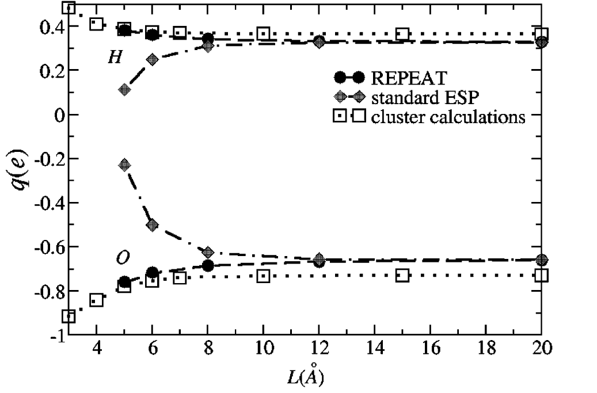

# Electrostatic Potential Derived Atomic Charges for Periodic Systems Using a Modified Error Functional: REPEAT Charges.  
 C. Campañá, B. Mussard, T.K. Woo, J. Chem. Theory Comput. **5** 2866 (2009)  
 ([doi](http://dx.doi.org/10.1021/ct9003405))
 ([bib](doc/CamMusWoo-JCTC-2009.bib))

([back to publications](../../))

## Abstract
A method to generate electrostatic potential (ESP) derived atomic charges in crystalline solids from periodic quantum mechanical calculations, termed the REPEAT method, is presented. Conventional ESP fitting procedures developed for molecular systems, in general, will not work for crystalline systems because the electrostatic potential in periodic systems is ill-defined up to a constant offset at each spatial position. In this work the problem is circumvented by introducing a new error functional which acts on the relative differences of the potential and not on its absolute values, as it is currently done with molecular ESP charge derivation methods. We formally demonstrate that the new functional reduces to the conventional error functional used in molecular ESP approaches when the simulation box of the periodic calculation becomes infinitely large. Several tests are presented to validate the new technique. For the periodic calculation of isolated molecules, the REPEAT charges are found to be in good agreement with those determined with established molecular ESP charge derivation methods. For siliceous sodalite, it is demonstrated that conventional molecular ESP approaches generate 'unphysical' charges, whereas the REPEAT method produces charges that are both chemically intuitive and consistent between different periodic electronic structure packages. The new approach is employed to generate partial atomic charges of various microporous materials and compared to both experimentally derived and molecular fragment ESP charges. This method can be used to generate partial atomic charges to be used in simulations of microporous and nanoporous materials, such as zeolites and metal organic framework materials.
