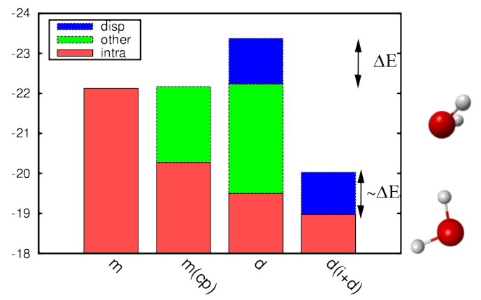

# Short-range DFT combined with long-range local RPA within a range-separated hybrid DFT framework.  
 E. Chermak, B. Mussard, J.G. Ángyán, P. Reinhardt, Chem. Phys. Lett. **550** 132 (2012)  
 ([pdf](doc/CheMusAngRei-CPL-2012.pdf))
 ([bib](doc/CheMusAngRei-CPL-2012.bib))
 ([doi](http://dx.doi.org/10.1016/j.cplett.2012.08.073))
 ([hal](http://hal.upmc.fr/hal-01137697))
 ([arxiv](http://arxiv.org/abs/1504.06139))
 
([back to publications](../../))

## Abstract
Selecting excitations in localized orbitals to calculate long-range correlation contributions to range-separated density-functional theory can reduce the overall computational effort significantly. Beyond simple selection schemes of excited determinants, the dispersion-only approximation, which avoids counterpoise-corrected monomer calculations, is shown to be particularly interesting in this context, which we apply to the random-phase approximation. The approach has been tested on dimers of formamide, water, methane and benzene. 
