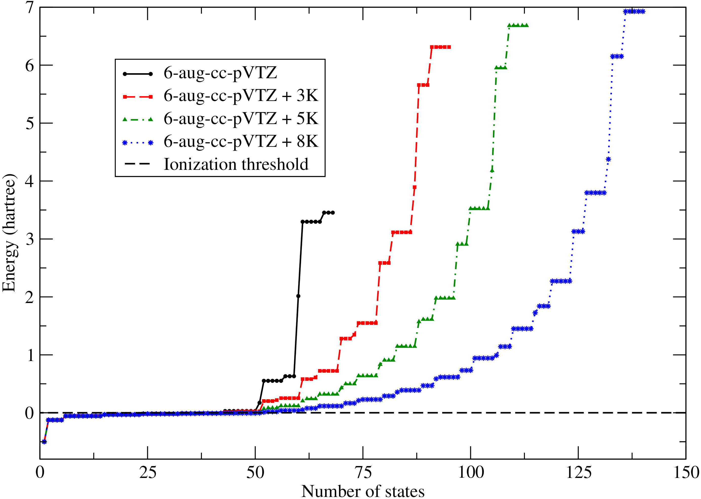

# Gaussian continuum basis functions for calculating high-harmonic generation spectra.  
 E. Coccia, B. Mussard, M. Labeye, J. Caillat, R. Taieb, J. Toulouse, E. Luppi, Int. J. Quantum Chem. **116** 1120 (2016)  
 ([pdf](doc/CocMusLabCaiTaiTouLup-IJQC-2016.pdf))
 ([bib](doc/CocMusLabCaiTaiTouLup-IJQC-2016.bib))
 ([doi](http://dx.doi.org/10.1002/qua.25146))
 ([hal](http://hal.upmc.fr/hal-01277883))
 ([arxiv](http://arxiv.org/abs/1602.07202))
 
([back to publications](https://github.com/mussard/publications/))

## Abstract
We explore the calculation of high-harmonic generation (HHG) spectra for the H atom in the dipole, velocity, and acceleration forms using Gaussian basis sets with the Gaussian continuum functions proposed by Kaufmann *et al.* [J. Phys. B: At. Mol. Opt. Phys. **22**, 2223 (1989)]. We study the effect of increasing the cardinal number of the basis set, the number of diffuse basis functions, and the number of Gaussian continuum basis functions for laser intensities from $I=5\\times 10^{13}$ to [\\times 10^{14}$ W/cm$^{2}$. We show that the addition of a few Gaussian continuum functions improves the description of the low-lying continuum states. For laser intensities up to $I=10^{14}$ W/cm$^{2}$, the addition of 5 or 8 Gaussian basis continuum functions decreases the background beyond the harmonic cutoff of the dipole form of the HHG spectrum, allowing one to better identify the cutoff region. These Gaussian continuum functions thus appear as a promising way of constructing Gaussian basis sets for studying electron dynamics in strong laser fields.
