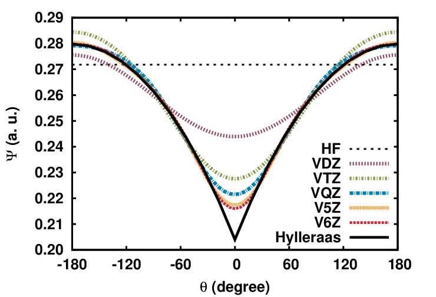

# Basis convergence of range-separated density-functional theory.  
 O. Franck, B. Mussard, E. Luppi, J. Toulouse, J. Chem. Phys. **142** 074107 (2015)  
 ([pdf](doc/FraMusLupTou-JCP-2015.pdf))
 ([bib](doc/FraMusLupTou-JCP-2015.bib))
 ([doi](http://dx.doi.org/10.1063/1.4907920))
 ([hal](http://hal.upmc.fr/hal-01081816))
 ([arxiv](http://arxiv.org/abs/1412.2613))
 
([back to publications](../../))

## Abstract
Range-separated density-functional theory is an alternative approach to Kohn-Sham density-functional theory. The strategy of range-separated density-functional theory consists in separating the Coulomb electron-electron interaction into long-range and short-range components, and treating the long-range part by an explicit many-body wave-function method and the short-range part by a density-functional approximation. Among the advantages of using many-body methods for the long-range part of the electron-electron interaction is that they are much less sensitive to the one-electron atomic basis compared to the case of the standard Coulomb interaction. Here, we provide a detailed study of the basis convergence of range-separated density-functional theory. We study the convergence of the partial-wave expansion of the long-range wave function near the electron-electron coalescence. We show that the rate of convergence is exponential with respect to the maximal angular momentum $L$ for the long-range wave function, whereas it is polynomial for the case of the Coulomb interaction. We also study the convergence of the long-range second-order Möller-Plesset correlation energy of four systems (He, Ne, N$_2$, and H$_2$O) with the cardinal number $X$ of the Dunning basis sets cc-pV$X$Z, and find that the error in the correlation energy is best fitted by an exponential in $X$. This leads us to propose a three-point complete-basis-set extrapolation scheme for range-separated density-functional theory based on an exponential formula.
