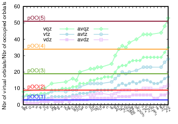

# Random phase approximation in projected oscillator orbitals  
 B. Mussard, Theor. Chem. Acc. **137** 165 (2018)  
 **In Memoriam of János Ángyán**  
 ([detail](detail/Mus-TCA-2018))
 ●
 ([pdf](doc/Mus-TCA-2018.pdf))
 ([bib](doc/Mus-TCA-2018.bib))
 ([doi](https://dx.doi.org/10.1007/s00214-018-2358-1))
 ([hal](https://hal.archives-ouvertes.fr/hal-01911815))
 ([arxiv](https://arxiv.org/abs/1811.03544))

The projected oscillator orbitals (pOOs) are localized virtual orbitals constructed by multiplying localized occupied orbitals by harmonics. Following a recent paper by Mussard and Ángyán (Theor Chem Acc 134:1, 2015), further developments of projected oscillator orbitals are shown, notably the equations for pOOs of general order as well as their overlaps are derived. The performance of these localized virtual orbitals is demonstrated up to third order. It is found that a good fraction of the aug-cc-pVQZ RPA correlation energy is recovered by use of a smaller number of pOOs. This is especially true where considering only the long-range correlation energy, which is important for the description of London dispersion forces.
