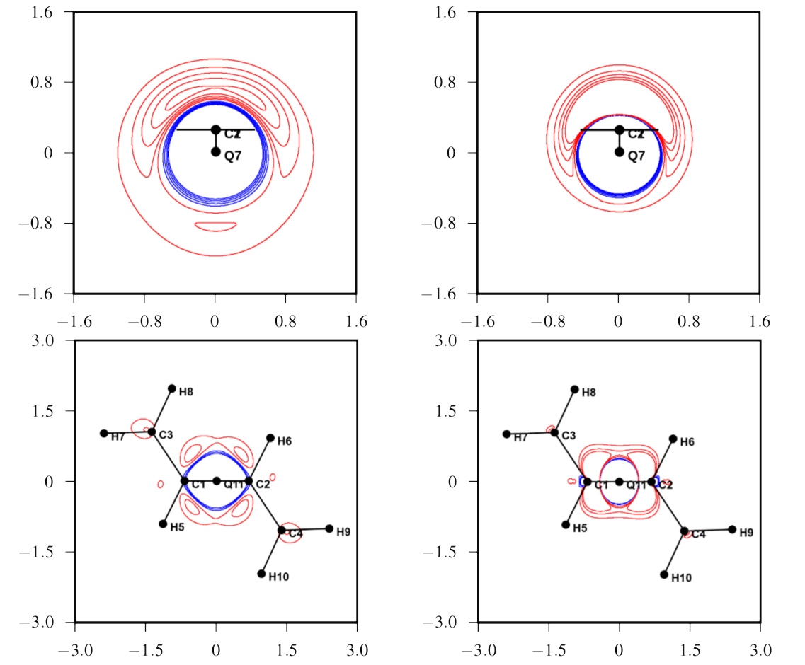

# Relationships between charge density response functions, exchange holes and localized orbitals.  
 B. Mussard, J.G. Ángyán, Comp. Theor. Chem. **1053** 44 (2015)  
 ([detail](detail/MusAng-CTC-2015))
 ●
 ([pdf](doc/MusAng-CTC-2015.pdf))
 ([bib](doc/MusAng-CTC-2015.bib))
 ([doi](http://dx.doi.org/10.1016/j.comptc.2014.10.039))
 ([hal](http://hal.upmc.fr/hal-01122075))
 ([arxiv](http://arxiv.org/abs/1503.00284))
 

The charge density response function and the exchange hole are closely related to each other via the fundamental fluctuation-dissipation theorem of physics. A simple approximate model of the static response function is visually compared on several examples in order to demonstrate this relationship.  This study is completed by illustrating the well-known  isomorphism between the exchange hole and the square of the dominant localized orbital lying in the space region of the reference point of the exchange hole function. The implications of these relationships for the interpretation of common chemical concepts, such as delocalization, are discussed. 
