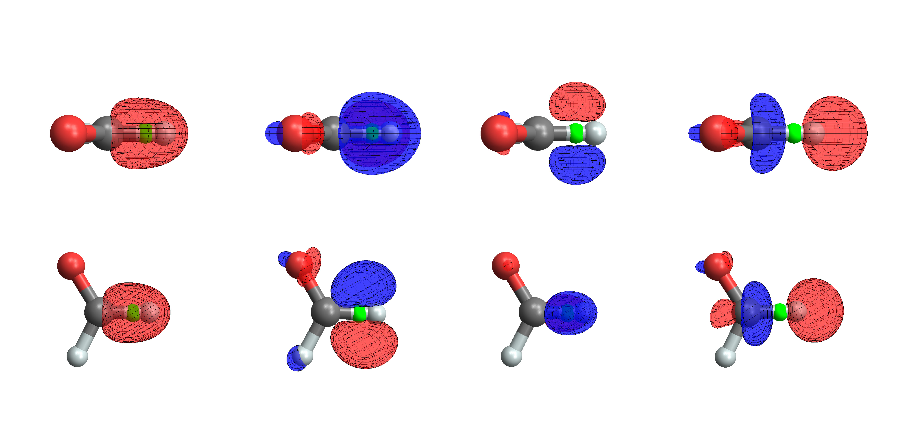

# Local Random Phase Approximation with Projected Oscillator Orbitals.  
 B. Mussard, J.G. Ángyán, Theor. Chem. Acc. **134** 1 (2015)  
 **Festschrift in honour of P.R. Surjan**  
 ([pdf](doc/MusAng-TCA-2015.pdf))
 ([bib](doc/MusAng-TCA-2015.bib))
 ([doi](http://dx.doi.org/10.1007/s00214-015-1751-2))
 ([doi](http://dx.doi.org/10.1007/978-3-662-49825-5_13))
 ([hal](http://hal.upmc.fr/hal-01229901))
 ([arxiv](http://arxiv.org/abs/1511.05725))

([back to publications](../../))

## Abstract
An approximation to the many-body London dispersion energy in molecular and/or solid state systems is expressed as a functional of the occupied orbitals. Starting from the local-RPA theory, where the occupied orbitals are localized molecular orbitals and the virtual space is approximated by projected oscillator orbitals, *i.e.* functions obtained by multiplying the occupied orbitals with spherical harmonic polynomials having their origin at the barycenter of the occupied virtual orbitals a non-empirical correlation energy expression is derived. Detailed expressions are given for the relevant matrix elements.
