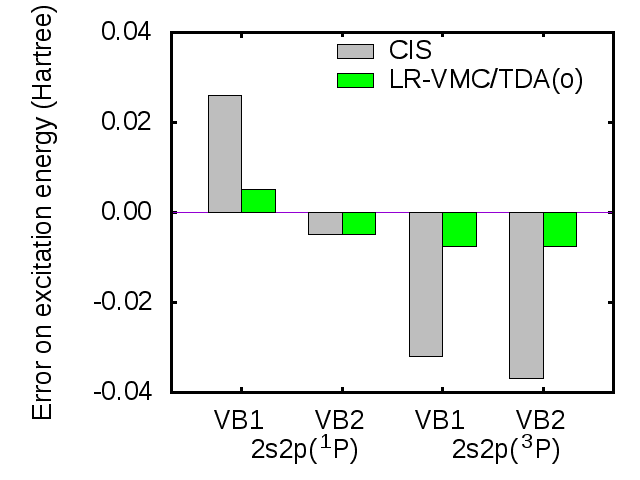

# Time-dependent linear-response variational Monte Carlo.  
 B. Mussard, E. Coccia, R. Assaraf, M. Otten, C. J. Umrigar, J. Toulouse, Adv. Quantum Chem. **76** 255 (2017)  
 ([detail](detail/MusCocAssOttUmrTou-AQC-2017))
 ●
 ([pdf](doc/MusCocAssOttUmrTou-AQC-2017.pdf))
 ([bib](doc/MusCocAssOttUmrTou-AQC-2017.bib))
 ([doi](https://doi.org/10.1016/bs.aiq.2017.05.005))
 ([hal](http://hal.upmc.fr/hal-01528081))
 ([arxiv](http://arxiv.org/abs/1705.09813))
 

We present the extension of variational Monte Carlo (VMC) to the calculation of electronic excitation energies and oscillator strengths using time-dependent linear-response theory. By exploiting the analogy existing between the linear method for wave-function optimisation and the generalised eigenvalue equation of linear-response theory, we formulate the equations of linear-response VMC (LR-VMC). This LR-VMC approach involves the first- and second-order derivatives of the wave function with respect to the parameters. We perform first tests of the LR-VMC method within the Tamm-Dancoff approximation using single-determinant Jastrow-Slater wave functions with different Slater basis sets on some singlet and triplet excitations of the beryllium atom. Comparison with reference experimental data and with configuration-interaction-singles (CIS) results shows that LR-VMC generally outperforms CIS for excitation energies and is thus a promising approach for calculating electronic excited-state properties of atoms and molecules.
