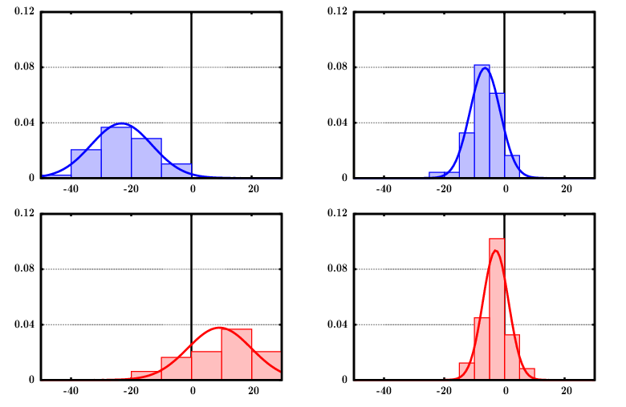

# Spin-unrestricted random-phase approximation with range separation: Benchmark on atomisation energies and energy barrier heights.  
 B. Mussard, P. Reinhardt, J.G. Ángyán, J. Toulouse, J. Chem. Phys. **142** 154123 (2015)  
 ([pdf](doc/MusReiAngTou-JCP-2015.pdf))
 ([bib](doc/MusReiAngTou-JCP-2015.bib))
 ([doi](http://dx.doi.org/10.1063/1.4918710))
 ([hal](http://hal.upmc.fr/hal-01141968))
 ([arxiv](http://arxiv.org/abs/1506.05907))
 ([suppmat](doc/MusReiAngTou-JCP-2015-SuppMat.pdf))
 ([erratum](doc/MusReiAngTou-JCP-2015-Erratum.pdf))

([back to publications](https://github.com/mussard/publications/))

## Abstract
We consider several spin-unrestricted random-phase approximation (RPA) variants for calculating correlation energies, with and without range separation, and test them on datasets of atomization energies and reaction barrier heights. We show that range separation greatly improves the accuracy of all RPA variants for these properties. Moreover, we show that a RPA variant with exchange, hereafter referred to as RPAx-SO2, first proposed by Szabo and Ostlund [A. Szabo and N. S. Ostlund, J. Chem. Phys. **67**, 4351 (1977)] in a spin-restricted closed-shell formalism, and extended here to a spin-unrestricted formalism, provides on average the most accurate range-separated RPA variant for atomization energies and reaction barrier heights. Since this range-separated RPAx-SO2 method had already been shown to be among the most accurate range-separated RPA variants for weak intermolecular interactions [J. Toulouse, W. Zhu, A. Savin, G. Jansen, and J. G. Ángyán, J. Chem. Phys. **135**, 084119 (2011)], this works confirms range-separated RPAx-SO2 as a promising method for general chemical applications.
