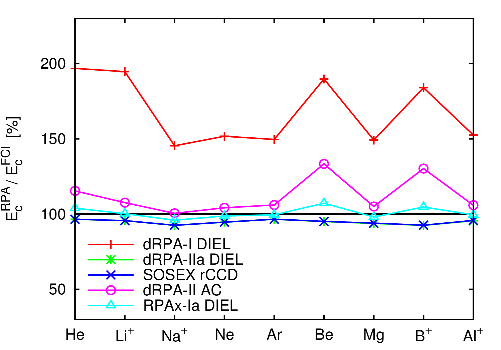

# Dielectric matrix formulation of correlation energies in the Random Phase Approximation (RPA): inclusion of exchange effects.  
 B. Mussard, D. Rocca, G. Jansen, J.G. Ángyán, J. Chem. Theory Comput. **12** 2191 (2016)  
 ([detail](detail/MusRocJanAng-JCTC-2016))
 ●
 ([pdf](doc/MusRocJanAng-JCTC-2016.pdf))
 ([bib](doc/MusRocJanAng-JCTC-2016.bib))
 ([doi](http://dx.doi.org/10.1021/acs.jctc.5b01129))
 ([hal](http://hal.upmc.fr/hal-01304895))
 ([arxiv](http://arxiv.org/abs/1604.06549))
 ([suppmat](doc/MusRocJanAng-JCTC-2016-SuppInfo.pdf))

Starting from the general expression for the ground state correlation energy in the adiabatic connection fluctuation dissipation theorem (ACFDT) framework, it is shown that the dielectric matrix formulation, which is usually applied to calculate the direct random phase approximation (dRPA) correlation energy, can be used for alternative RPA expressions including exchange effects. Within this famework, the ACFDT analog of the second order screened exchange (SOSEX) approximation leads to a logarithmic formula for the correlation energy similar to the direct RPA expression. Alternatively, the contribution of the exchange can be included in the kernel used to evaluate the response functions. In this case the use of an approximate kernel is crucial to simplify the formalism and to obtain a correlation energy in logarithmic form. Technical details of the implementation of these methods are discussed and it is shown that one can take advantage of density fitting or Cholesky decomposition techniques to improve the computational efficiency; a discussion on the numerical quadrature made on the frequency variable is also provided. A series of test calculations on atomic correlation energies and molecular reaction energies shows that exchange effects are instrumental to improve over direct RPA results.
