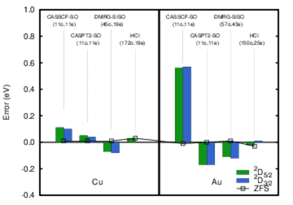

# One-step treatment of spin-orbit coupling and electron correlation in large active spaces  
 B. Mussard, S. Sharma, J. Chem. Theory Comput. **14** 154 (2017)  
 ([pdf](doc/MusSha-JCTC-2017.pdf))
 ([bib](doc/MusSha-JCTC-2017.bib))
 ([doi](https://dx.doi.org/10.1021/acs.jctc.7b01019))
 ([hal](http://hal.upmc.fr/hal-01612879))
 ([arxiv](http://arxiv.org/abs/1710.00259))
 
([back to publications](https://github.com/mussard/publications/))

## Abstract
In this work we demonstrate that the heat bath configuration interaction (HCI) and its semistochastic extension can be used to treat relativistic effects and electron correlation on an equal footing in large active spaces to calculate the low energy spectrum of several systems including halogens group atoms (F, Cl, Br, I), coinage atoms (Cu, Au) and the Neptunyl(VI) dioxide radical. This work demonstrates that despite a significant increase in the size of the Hilbert space due to spin symmetry breaking by the spin-orbit coupling terms, HCI retains the ability to discard large parts of the low importance Hilbert space to deliver converged absolute and relative energies. For instance, by using just over 10^7 determinants we get converged excitation energies for Au atom in an active space containing (150o,25e) which has over 10^30 determinants. We also investigate the accuracy of five different two-component relativistic Hamiltonians in which different levels of ap- proximations are made in deriving the one-electron and two-electrons Hamiltonians, ranging from Breit-Pauli (BP) to various flavors of exact two-component (X2C) theory. The relative accuracy of the different Hamiltonians are compared on systems that range in atomic number from first row atoms to actinides.
