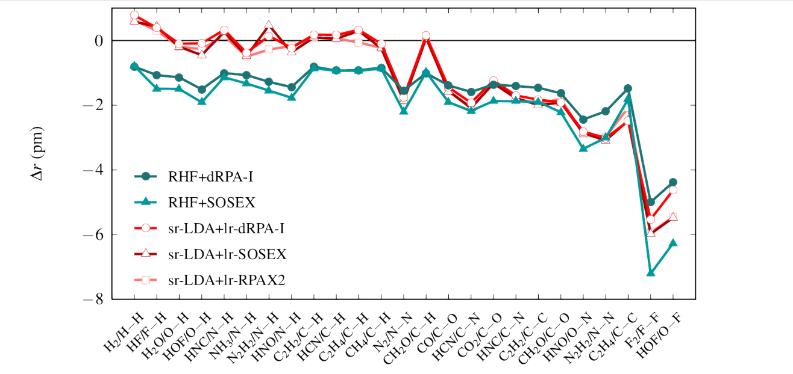

# Analytical Energy Gradients in Range-Separated Hybrid Density Functional Theory with Random Phase Approximation.  
 B. Mussard, P. Szalay, J.G. Ángyán, J. Chem. Theory Comput. **10** 1968 (2014)  
 ([pdf](doc/MusSzaAng-JCTC-2014.pdf))
 ([bib](doc/MusSzaAng-JCTC-2014.bib))
 ([doi](http://dx.doi.org/10.1021/ct401044h))
 ([hal](http://hal.upmc.fr/hal-01122081))
 ([arxiv](http://arxiv.org/abs/1503.00277))
 
([back to publications](https://github.com/mussard/publications/))

## Abstract
Analytical forces have been derived in the Lagrangian framework for several RPA (random phase approximation) correlated total energy expressions based on the range separated hybrid (RSH) RPA theory, which combines a short-range density functional approximation for the short-range exchange and correlation energy with a Hartree-Fock-type long-range exchange and RPA long-range correlation. The RPA correlation energy is formulated as a ring coupled cluster doubles (rCCD) theory. The resulting analytical gradients have been implemented and tested for bond lengths of simple molecules and for intermolecular charge transfer complexes, where intermolecular interactions have a non-negligible effect on the monomer geometries. 
