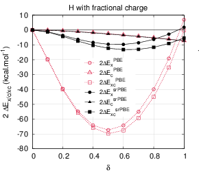

# Fractional-charge and fractional-spin errors in range-separated density-functional theory.  
 B. Mussard, J. Toulouse, Mol. Phys. **115** 161 (2017)  
 ([pdf](doc/MusTou-MP-2017.pdf))
 ([bib](doc/MusTou-MP-2017.bib))
 ([doi](http://dx.doi.org/10.1080/00268976.2016.1213910))
 ([hal](http://hal.upmc.fr/hal-01344404))
 ([arxiv](http://arxiv.org/abs/1607.03621))
 
([back to publications](https://github.com/mussard/publications/))

## Abstract
We investigate fractional-charge and fractional-spin errors in range-separated density-functional theory. Specifically, we consider the range-separated hybrid (RSH) method which combines long-range Hartree-Fock (HF) exchange with a short-range semilocal exchange-correlation density functional, and the RSH+MP2 method which adds long-range second-order Möller-Plesset (MP2) correlation. Results on atoms and molecules show that the fractional-charge errors obtained in RSH are much smaller than in the standard Kohn-Sham (KS) scheme applied with semilocal or hybrid approximations, and also generally smaller than in the standard HF method. The RSH+MP2 method tends to have smaller fractional-charge errors than standard MP2 for the most diffuse systems, but larger fractional-charge errors for the more compact systems. Even though the individual contributions to the fractional-spin errors in the H atom coming from the short-range exchange and correlation density-functional approximations are smaller than the corresponding contributions for the full-range exchange and correlation density-functional approximations, RSH gives fractional-spin errors that are larger than in the standard KS scheme and only slightly smaller than in standard HF. Adding long-range MP2 correlation only leads to infinite fractional-spin errors. This work clarifies the successes and limitations of range-separated density-functional theory approaches for eliminating self-interaction and static-correlation errors.
