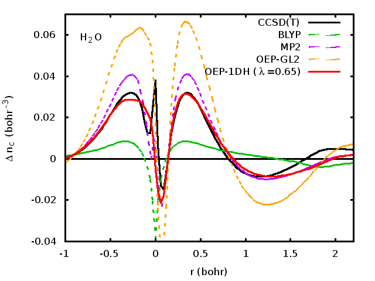

# Self-consistent double-hybrid density-functional theory using the optimized-effective-potential method.  
 S. Śmiga, O. Franck, B. Mussard, A. Buksztel, I. Grabowski, E. Luppi, J. Toulouse, J. Chem. Phys. **145** 144102 (2016)  
 ([detail](detail/SmiFraMusBukGraLupTou-JCP-2016))
 ●
 ([pdf](doc/SmiFraMusBukGraLupTou-JCP-2016.pdf))
 ([bib](doc/SmiFraMusBukGraLupTou-JCP-2016.bib))
 ([doi](http://dx.doi.org/10.1063/1.4964319))
 ([hal](http://hal.upmc.fr/hal-01346158))
 ([arxiv](https://arxiv.org/abs/1607.05481))
 

We introduce an orbital-optimized double-hybrid (DH) scheme using the optimized-effective-potential (OEP) method. The orbitals are optimized using a local potential corresponding to the complete exchange-correlation energy expression including the second-order Möller-Plesset (MP2) correlation contribution. We have implemented a one-parameter version of this OEP-based self-consistent DH scheme using the BLYP density-functional approximation and compared it to the corresponding non-self-consistent DH scheme for calculations on a few closed-shell atoms and molecules. While the OEP-based self-consistency does not provide any improvement for the calculations of ground-state total energies and ionization potentials, it does improve the accuracy of electron affinities and restores the meaning of the LUMO orbital energy as being connected to a neutral excitation energy. Moreover, the OEP-based self-consistent DH scheme provides reasonably accurate exchange-correlation potentials and correlated densities.

