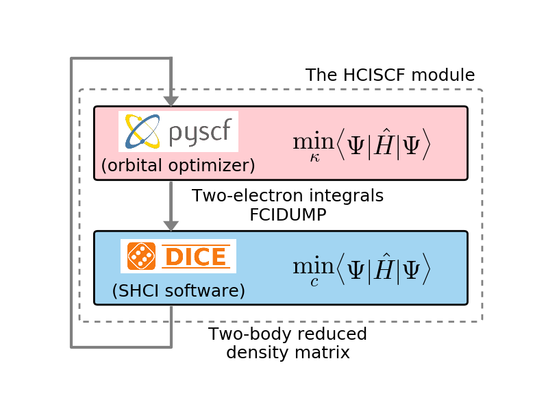

# Cheap and near exact CASSCF with large active spaces  
 J. E. T. Smith, B. Mussard, A. A. Holmes, S. Sharma, J. Chem. Theory Comput. **13** 5468 (2017)  
 **JCTC Editors' Choice for 2017**  
 ([detail](detail/SmiMusHolSha-JCTC-2017))
 ●
 ([pdf](doc/SmiMusHolSha-JCTC-2017.pdf))
 ([bib](doc/SmiMusHolSha-JCTC-2017.bib))
 ([doi](https://doi.org/10.1021/acs.jctc.7b00900))
 ([hal](http://hal.upmc.fr/hal-01612876))
 ([arxiv](http://arxiv.org/abs/1708.07544))

We use the recently-developed Heat-bath Configuration Interaction (HCI) algorithm as an efficient active-space solver to perform multi-configuration self-consistent field calculations (HCISCF) with large active spaces. We give a detailed derivation of the theory and show that difficulties associated with non-variationality of the HCI procedure can be overcome by making use of the Lagrangian formulation to calculate the HCI relaxed two body reduced density matrix. HCISCF is then used to study the electronic structure of butadiene, pentacene, and Fe-porphyrin. One of the most striking results of our work is that the converged active space orbitals obtained from HCISCF are relatively insensitive to the accuracy of the HCI calculation. This allows us to obtain nearly converged CASSCF energies with an estimated error of less than 1 mHa using the orbitals obtained from the HCISCF procedure in which the integral transformation is the dominant cost. For example, an HCISCF calculation on Fe-Porphyrin model complex with an active space of (44e, 44o) took only 412 seconds per iteration on a single node containing 28 cores, out of which 185 seconds were spent in the HCI calculation and the remaining 227 seconds were mainly used for integral transformation. Finally, we also show that active-space orbitals can be optimized using HCISCF to substantially speed up the convergence of the HCI energy to the Full CI limit because HCI is not invariant to unitary transformations within the active space.

